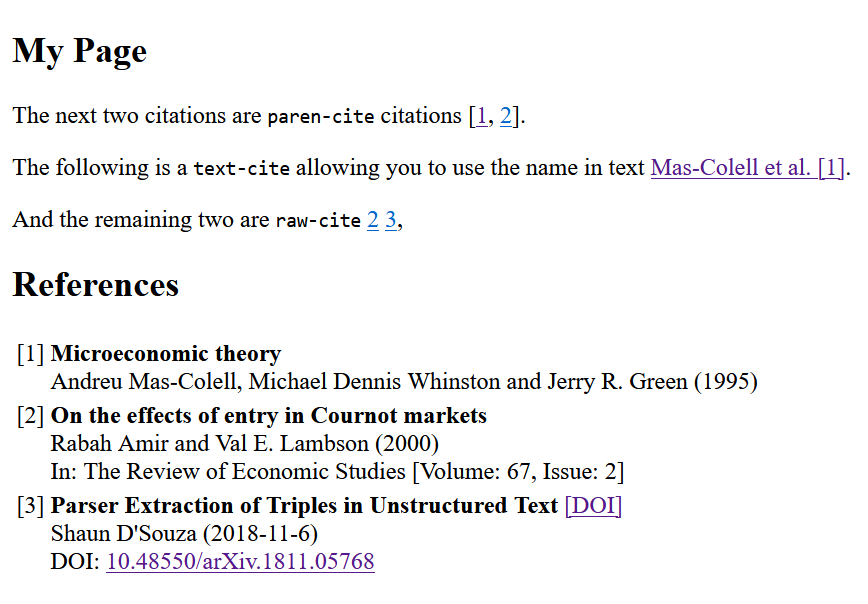

[](https://www.jsdelivr.com/package/npm/bibcite)
# Bibcite

BibTeX or BibLaTeX like citation for HTML.

> Brand new and (probably) full of bugs

## Browser Usage


1. Export your library from your favorite reference management software (e.g.
[Zotero][zotero]) in the CSL-JSON format ([Detailed
Explanation][export-csl-explanation]).
2. Obtain the Javascript file of Bibcite ([e.g. from JSDelivr][releases]) looking like this
  
    > https://cdn.jsdelivr.net/npm/bibcite@1.0/dist/bibcite.min.js

3. Assuming you have an exported `csl-json` file, which we are going to call
`references.json` from now on (but you can use any other filename). And a link
to the JS file of `bibcite` (here called `bibcite.js`) you can do the following in
an html file

    ```html
    <head>
      <script src="bibcite.js"></script>
      <bib-config bib="references.json"></bib-config>
    </head>
    <body>
      <p>
        This is an example of parenthical citation:
        <bib-cite key="id in references.json"></bib-cite>
      </p>

      <bib-references></bib-references>
    </body>
    ```

### Configuration Options

1. At the moment there are two citation-styles `alphabetic`(default) and
`numeric` you can select them like this:

	```html
	<bib-config bib="references.json" citation-style="numeric"></bib-config>
	```

2. There are three types of citations inspired by BibLaTeX `\textcite`,
`\parencite` and `\rawcite`. You can set the `type` of `bib-cite` to either
	`paren-cite` (default) `text-cite` or `raw-cite`, e.g.

	```html
	<bib-cite key="id_key" type="text-cite"></bib-cite>
	```

### Examples

The following body

```html
		<h1>My Page</h1>	
		<p> The next two citations are <code>paren-cite</code> citations
			<bib-cite type="paren-cite" key="mas-colellMicroeconomicTheory1995"></bib-cite>
			<bib-cite type="paren-cite" key="amirEffectsEntryCournot2000"></bib-cite>.
		</p>
		<p>
			The following is a <code>text-cite</code> allowing you to use the name in text
			<bib-cite type="text-cite" key="mas-colellMicroeconomicTheory1995"></bib-cite>.
		</p>
		<p>
			And the remaining two are <code>raw-cite</code>
			<bib-cite type="raw-cite" key="amirEffectsEntryCournot2000"></bib-cite>
			<bib-cite type="raw-cite" key="dsouzaParserExtractionTriples2018"></bib-cite>,
		</p>

		<bib-references></bib-references>
```

depending on the selected style results in the following pages.

#### Alphabetic style (Default)

```html
<bib-config bib="references.json" citation-style="alphabetic"></bib-config>
```


#### Numeric style

```html
<bib-config bib="references.json" citation-style="numeric"></bib-config>
```



#### Author-Year Style


```html
<bib-config bib="references.json" citation-style="author-year"></bib-config>
```


## Node Module

You can find [`bibcite` on npm][npm-bibcite].

### Custom Styles

There will be a way to do customization in the future. Styles are Typescript
types

```typescript
// bibcite/styles/types.ts
export type CiteStyle = {
  name: string;
  order: BibOrder;
  enclosing: [string, string];
  multiSeparator: string;
  identifier: (bib_data: Data,index: number, citeType: CiteType) => string;
  bibEntry: (bib_data: Data) => string;
  metaBibEntry: (bibEntry:string, identifier:string) => string;
  metaReference: (content: string) => string;
};
```

so the numeric style for example is implemented roughly like this:

```typescript
//bibcite/styles/numeric.ts
export const numeric: CiteStyle = {
  name: "numeric",
  order: { comparison: insertion, inform_citations: true },
  enclosing: ["[", "]"],
  multiSeparator: ",",
  identifier: (_: Data, index: number) => String(index),
  bibEntry: defaultBibEntry,
  metaBibEntry: (bibEntry:string, identifier:string) => `
    <tr style="vertical-align:top">
        <td>[${identifier}]</td>
        <td>${bibEntry}</td>
    </tr>
    `,
  metaReference: (content: string) =>
    `<h2>References</h2>
    <table>
      ${content}
    </table>
    `,
};
```

and then added

```typescript
//bibcite/ctyles/index.ts
addStyle(numeric);
```

So similarly you should be able to define your own custom styles.
I still need to figure out how to do plugin loading here though.

[zotero]: https://www.zotero.org/
[export-csl-explanation]: https://github.com/FelixBenning/bibcite/blob/main/docs/export-csl-json.md
[releases]: https://www.jsdelivr.com/package/npm/bibcite
[npm-bibcite]: https://www.npmjs.com/package/bibcite
