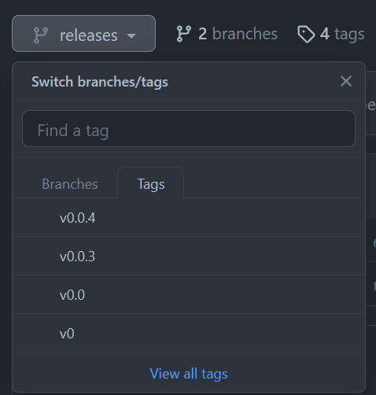
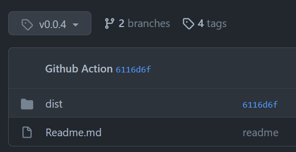
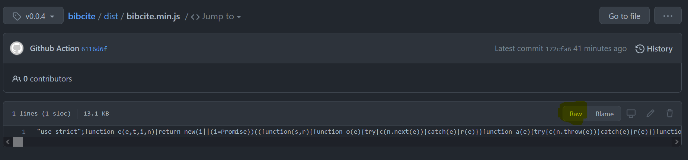
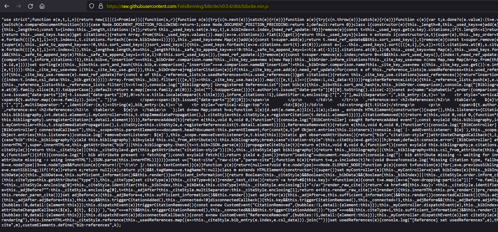

# Releases

All tags will point to commits in this branch, e.g.

```html
<script src"https://raw.githubusercontent.com/FelixBenning/bibcite/v0.0.4/dist/bibcite.min.js"></script>
```

There are minor `vX.X` and major `vX` tags which might be overwritten. Use a
full version `vX.X.X` if you do not ever want the underlying file to change.
This project will follow [semantic versioning](https://semver.org/), so you
should be safe to use major tags if you trust me and want to stay up to date.

## Detailed Github UI Walkthrough

Simply choose the version you want to use from the tags:



Once you selected a tag, click on the `dist` folder



In this folder open either the minified or unminified version of `bibcite.js`
depending on your preference. Now let GitHub show you the raw file



Once you clicked that button, you can copy the link from your browser.



