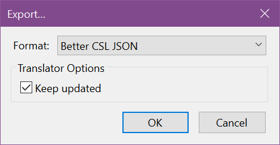

# Zotero

Export a library (or collection)

Select the CSL JSON format (keep updated if applicable)

| Vanilla Zotero | [Better Bibtex Zotero](https://retorque.re/zotero-better-bibtex/) |
| --- | ---- | 
|  | |

Finally Choose a file location and name.

